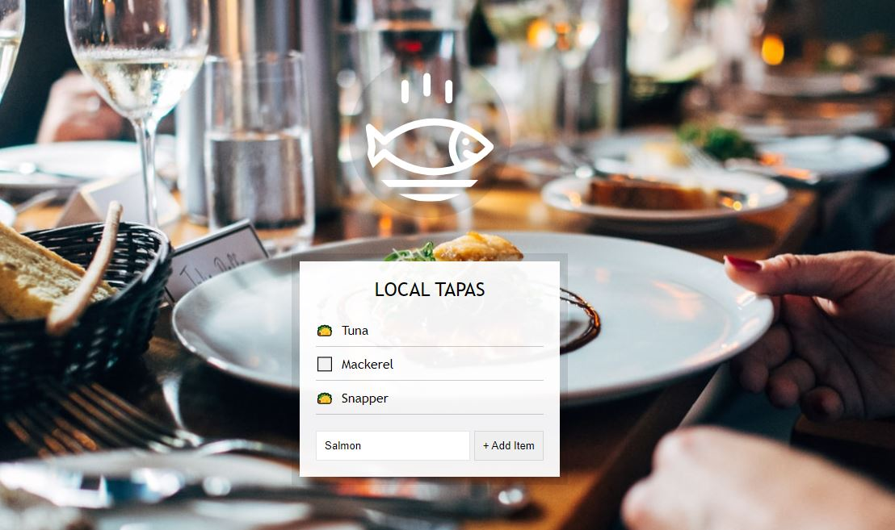

# localstorage

This is project 15 in Wes Bos' JavaScript 30 course.  This week we built a dynamic list that is stored in local storage so it won't be reset even with a hard browser reset. The project uses a function to populate html list items then JSON.stringify and localStorage to keep them populated after the reset.  If you're interested in doing the project yourself, you can find the lesson <a href="https://www.youtube.com/watch?v=YL1F4dCUlLc&list=PLu8EoSxDXHP6CGK4YVJhL_VWetA865GOH&index=15">here.</a>

